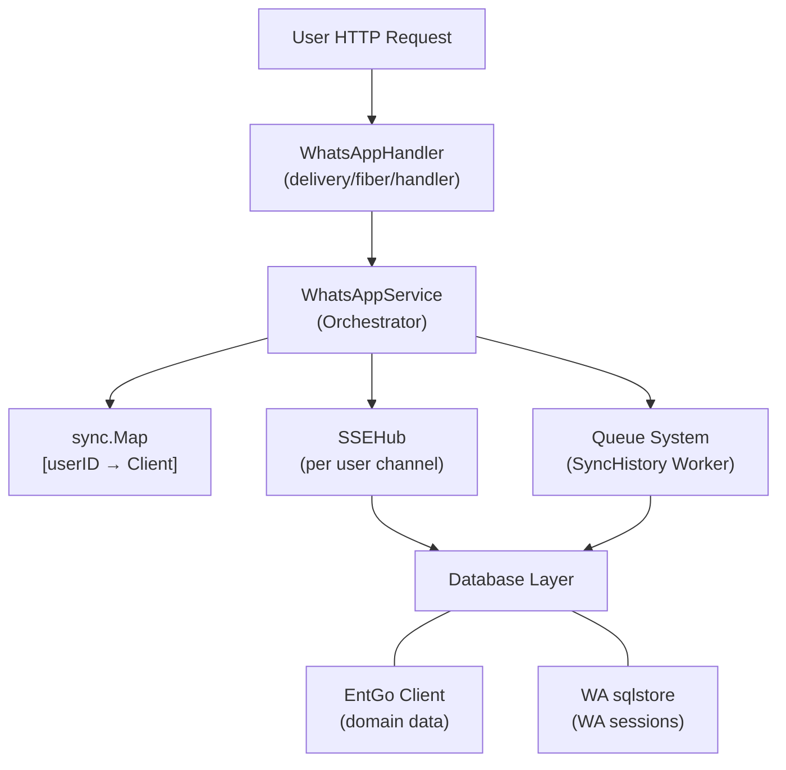
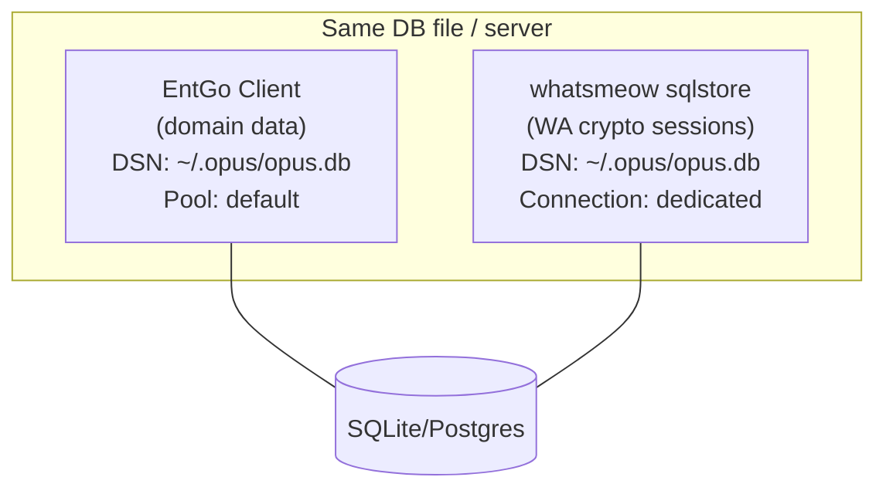
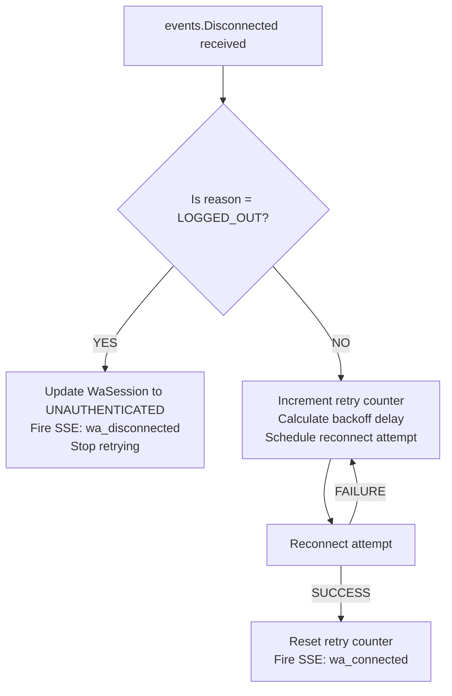

# Design Spec: WhatsApp Service Implementation

**Topic:** Implementation of `WhatsAppService` using `whatsmeow` with Hybrid Sync (SSE + Queue)
**Date:** 2026-05-16
**Status:** Approved
**Authors:** Product & Architecture Team

---

## Table of Contents

1. [Overview](#1-overview)
2. [Architecture](#2-architecture)
3. [Detailed Components](#3-detailed-components)
4. [Database Integration](#4-database-integration)
5. [Reconnection Strategy](#5-reconnection-strategy)
6. [Testing & Quality](#6-testing--quality)
7. [Success Criteria](#7-success-criteria)
8. [Implementation Steps](#8-implementation-steps)

---

## 1. Overview

This specification outlines the implementation of the `WhatsAppService` logic using the `whatsmeow` library. The goal is to provide a reliable, multi-user WhatsApp integration that supports:

- Real-time messaging and status updates via **user-specific SSE channels**.
- Heavy data synchronization (history, contacts, chats) via the **Opus Queue System**.
- Autonomous 24/7 session management with **indefinite auto-retry** and a **Force Reconnect** escape hatch in the UI.

---

## 2. Architecture

### 2.1 High-Level Overview



### 2.2 Key Design Decisions

| Decision | Choice | Rationale |
|----------|--------|-----------|
| SSE Channel | User-specific | Prevents event leakage between users in multi-user setup |
| `whatsmeow` sqlstore | Separate DB connection | Avoids locking conflicts with EntGo, especially on SQLite |
| HistorySync payload | Pre-processed domain structs (JSON) | Readable in DLQ, decoupled from whatsmeow proto schema |
| Reconnection | Indefinite auto-retry with exponential backoff | Aligns with Opus 24/7 autonomous agent vision |
| Test coverage target | 80% service logic, 90% repository | Pragmatic; whatsmeow callbacks excluded from target |

---

## 3. Detailed Components

### 3.1 `WhatsAppService` Interface (Refined)

```go
// internal/service/whatsapp.go

type WhatsAppService interface {
    // Initialize re-connects all CONNECTED users on server boot (runs in parallel).
    Initialize(ctx context.Context) error

    // Connect initiates a new whatsmeow client and starts the QR pairing process.
    Connect(ctx context.Context, userID string) error

    // Disconnect logs out the session and clears the whatsmeow sqlstore for the user.
    Disconnect(ctx context.Context, userID string) error

    // ForceReconnect resets the retry counter and immediately attempts reconnection.
    ForceReconnect(ctx context.Context, userID string) error

    // GetStatus returns the current connection status and JID for a user.
    GetStatus(ctx context.Context, userID string) (status string, jid string, err error)

    // SendMessage sends a text message to the target JID on behalf of the user.
    SendMessage(ctx context.Context, userID string, targetJID string, message string) error
}
```

### 3.2 In-Memory Client Management

- Active `whatsmeow.Client` instances are stored in a `sync.Map` keyed by `userID`.
- All access to the map **must** be guarded; `sync.Map` handles concurrent read/write safety natively.
- A companion `retryState` map (also `sync.Map`) tracks retry count and backoff timer per user.

```go
type whatsAppService struct {
    clients    sync.Map // map[string]*whatsmeow.Client
    retryState sync.Map // map[string]*retryEntry
    repo       WhatsAppRepository
    sseHub     SSEHub
    queue      service.Queue
    db         *ent.Client
    cfg        *config.Config
    log        *slog.Logger
}

type retryEntry struct {
    attempts int
    timer    *time.Timer
    mu       sync.Mutex
}
```

### 3.3 Event Handling

All `whatsmeow` events are handled in a per-client event handler registered during `Connect()`.

| whatsmeow Event | Action | SSE Event |
|----------------|--------|-----------|
| `events.QR` | Encode QR string, dispatch to user SSE channel | `wa_qr_update` |
| `events.Connected` | Update `WaSession` status to `CONNECTED`, reset retry state | `wa_connected` |
| `events.Disconnected` | Trigger reconnection strategy (see Section 5) | `wa_disconnected` |
| `events.Message` | Save to `WaMessage` via EntGo, dispatch to SSE | `wa_new_message` |
| `events.HistorySync` | Transform to `SyncHistoryPayload`, push to Queue | *(none — async)* |

### 3.4 SSE Integration

Uses the existing `/stream` endpoint with **user-specific channels** to isolate events per user.

```go
// SSEHub dispatches events to a specific user's channel only.
type SSEHub interface {
    Publish(userID string, event SSEEvent) error
}

type SSEEvent struct {
    Type    string `json:"type"`
    Payload any    `json:"payload"`
}
```

**Defined event types:**

| Event Type | Payload |
|-----------|---------|
| `wa_qr_update` | `{ "qr": "<string>" }` |
| `wa_connected` | `{ "jid": "<string>" }` |
| `wa_disconnected` | `{ "reason": "<string>" }` |
| `wa_new_message` | `{ "chat_jid": "<string>", "sender": "<string>", "content": "<string>", "timestamp": "<ISO8601>" }` |

### 3.5 Queue Worker: `SyncHistoryWorker`

History sync events from WhatsApp are heavy (potentially thousands of messages). These are offloaded to the Queue System to avoid blocking the event handler goroutine.

**Job Type:** `whatsapp.sync_history`

**Payload Structure (JSON):**

```go
type SyncHistoryPayload struct {
    UserID   string         `json:"user_id"`
    Contacts []WAContact    `json:"contacts"`
    Chats    []WAChat       `json:"chats"`
    Messages []WAMessage    `json:"messages"`
}

type WAContact struct {
    JID      string `json:"jid"`
    Name     string `json:"name"`
    PushName string `json:"push_name,omitempty"`
}

type WAChat struct {
    JID         string `json:"jid"`
    Name        string `json:"name,omitempty"`
    UnreadCount int    `json:"unread_count"`
}

type WAMessage struct {
    MessageID  string    `json:"message_id"`
    ChatJID    string    `json:"chat_jid"`
    SenderJID  string    `json:"sender_jid"`
    Content    string    `json:"content,omitempty"`
    Timestamp  time.Time `json:"timestamp"`
    IsFromMe   bool      `json:"is_from_me"`
}
```

**Worker Behaviour:**

- Upserts `WaContact`, `WaChat`, and `WaMessage` records via EntGo.
- Integrated with Dead Letter Queue (DLQ) — failed jobs after `MaxRetries` are moved to `dead_letters` for manual inspection and retry.
- Runs in a separate goroutine via the Opus Worker Engine.

---

## 4. Database Integration

### 4.1 Dual Connection Strategy

`whatsmeow` uses its own internal `sqlstore` for cryptographic session data (keys, pre-keys, sender keys). This is intentionally **kept separate** from the EntGo connection to avoid locking conflicts, particularly on SQLite.



### 4.2 Driver Support

Both `sqlite3` and `postgres` are supported. The driver is resolved at runtime from `config.Database.Driver`:

```go
// internal/config/whatsapp.go

func GetWhatsAppStore(cfg *config.Config) (*sqlstore.Container, error) {
    switch cfg.Database.Driver {
    case "sqlite":
        return sqlstore.New("sqlite3", cfg.Database.DSN+"?_fk=1", waLog.Stdout("WA-Store", "WARN", true))
    case "postgres":
        return sqlstore.New("postgres", cfg.Database.DSN, waLog.Stdout("WA-Store", "WARN", true))
    default:
        return nil, fmt.Errorf("unsupported database driver for whatsapp store: %s", cfg.Database.Driver)
    }
}
```

---

## 5. Reconnection Strategy

### 5.1 Overview

Opus is designed as a 24/7 autonomous agent. WhatsApp sessions must recover automatically from transient failures (network blips, server restarts) without user intervention.

### 5.2 Reconnection Flow



### 5.3 Backoff Schedule

Exponential backoff capped at **30 minutes**:

| Attempt | Delay |
|---------|-------|
| 1 | 5 seconds |
| 2 | 15 seconds |
| 3 | 30 seconds |
| 4 | 1 minute |
| 5 | 5 minutes |
| 6+ | 30 minutes (cap) |

A ±10% jitter is applied to each delay to prevent thundering herd on multi-user server restart.

### 5.4 Force Reconnect (UI Escape Hatch)

Available in the Dashboard under **Settings → WhatsApp**.

**Behaviour:**
1. Cancel any pending retry timer.
2. Reset retry counter to `0`.
3. Immediately attempt reconnect.
4. If session is still valid → reconnects without QR.
5. If session is invalid (e.g., revoked on phone) → generates new QR code, fires `wa_qr_update` via SSE.

**API Endpoint:**

```
POST /whatsapp/reconnect
Auth: Required (JWT)
Response: { "message": "reconnect initiated" }
```

### 5.5 `LOGGED_OUT` Handling

When WhatsApp explicitly logs out the device (e.g., user removes device from phone settings):

- Update `WaSession.Status` to `UNAUTHENTICATED`.
- Clear the `whatsmeow` sqlstore device entry.
- Remove client from in-memory `sync.Map`.
- Fire SSE `wa_disconnected` with `reason: "logged_out"`.
- **Do not** auto-retry — user must re-pair by scanning a new QR code.

---

## 6. Testing & Quality

### 6.1 Coverage Targets

| Layer | Target | Notes |
|-------|--------|-------|
| `WhatsAppService` (service logic) | ≥ 80% | whatsmeow event callbacks excluded |
| `WhatsAppRepository` (EntGo data access) | ≥ 90% | Full integration test coverage |
| `WhatsAppHandler` (HTTP layer) | ≥ 70% | Happy path + error cases |
| `SyncHistoryWorker` | ≥ 80% | Tested with mock Queue driver |

### 6.2 Unit Tests

- Location: co-located with service logic (`internal/service/whatsapp_test.go`)
- Mocks: generated via `go.uber.org/mock/mockgen`, stored in `api/mocks/`
- Mocked interfaces: `WhatsAppRepository`, `SSEHub`, `service.Queue`

```go
// Example: Test Connect() dispatches QR event via SSE
mockHub.EXPECT().Publish("user-123", gomock.MatchedBy(func(e SSEEvent) bool {
    return e.Type == "wa_qr_update"
})).Return(nil)
```

### 6.3 Integration Tests

- Location: `internal/repository/whatsapp_integration_test.go`
- Build tag: `//go:build integration`
- Database: SQLite in-memory
- Scope: full `UpsertSession → GetSessionByUserID → UpdateStatus` lifecycle

### 6.4 Mock Generation

```bash
# Regenerate all WhatsApp-related mocks
mockgen -source=internal/service/whatsapp.go -destination=mocks/mock_whatsapp_service.go -package=mocks
mockgen -source=internal/repository/whatsapp.go -destination=mocks/mock_whatsapp_repository.go -package=mocks
```

---

## 7. Success Criteria

- [ ] Server boot re-initializes all `CONNECTED` user sessions in parallel.
- [ ] QR code is delivered to the correct user's SSE channel only (no cross-user leakage).
- [ ] `HistorySync` events are processed asynchronously via Queue without blocking event handler.
- [ ] Disconnected sessions auto-retry with exponential backoff (capped at 30 minutes).
- [ ] `LOGGED_OUT` events do not trigger auto-retry.
- [ ] Force Reconnect resets retry counter and immediately initiates reconnection.
- [ ] Force Reconnect generates new QR if session is invalid.
- [ ] Both SQLite and PostgreSQL are supported for `whatsmeow` sqlstore.
- [ ] All unit and integration tests pass (`task test:all`).
- [ ] Coverage targets met (Section 6.1).

---

## 8. Implementation Steps

1. **Add `whatsmeow` dependency** — `go get go.mau.fi/whatsmeow@latest`.
2. **Implement `GetWhatsAppStore()`** — dedicated DB connection factory in `internal/config/whatsapp.go`.
3. **Implement `whatsAppService`** — full service logic with `sync.Map` client management, event handlers, and retry state machine.
4. **Implement `SyncHistoryWorker`** — queue consumer for `whatsapp.sync_history` job type.
5. **Implement `SSEHub` per-user channel** — update existing SSE infrastructure to support user-scoped publishing.
6. **Add `ForceReconnect` API endpoint** — `POST /whatsapp/reconnect` in `WhatsAppHandler`.
7. **Wire up in `server.go`** — register `WhatsAppHandler` routes under `/whatsapp`.
8. **Register `SyncHistoryWorker`** in `cmd/opus/start.go` engine handler registry.
9. **Update Dashboard UI** — Settings page with Force Reconnect button; handle `wa_disconnected` with reason display.
10. **Write tests** — unit + integration, validate coverage targets.