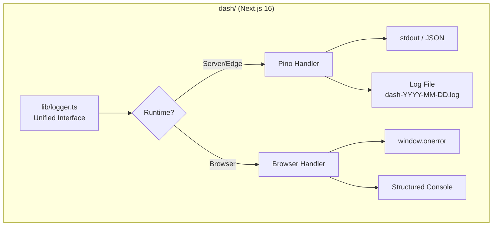
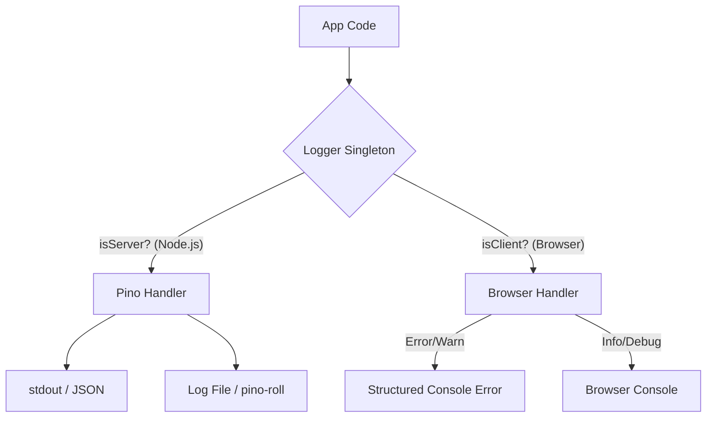

# Design Spec: Opus Logging & Error Tracking Strategy

**Product:** Opus
**Version:** 1.0.1
**Status:** Draft
**Last Updated:** 2026-05-17
**Authors:** Product & Architecture Team

---

## Table of Contents

1. [Overview](#1-overview)
2. [Architecture](#2-architecture)
3. [Isomorphic Logger](#3-isomorphic-logger)
4. [Server-Side Logging — Pino](#4-server-side-logging--pino)
5. [Client-Side Logging](#5-client-side-logging)
6. [Log File Strategy](#6-log-file-strategy)
7. [Security & Privacy](#7-security--privacy)
8. [Configuration](#8-configuration)
9. [Directory Structure](#9-directory-structure)
10. [Dependencies](#10-dependencies)
11. [Task Automation](#11-task-automation)
12. [Success Criteria](#12-success-criteria)

---

## 1. Overview

This document defines the logging and error tracking strategy for the Opus dashboard (`dash/`), a Next.js 16 application. The goal is to provide high observability for server-side operations and capture client-side errors in a structured, privacy-conscious manner — without mandating external third-party services.

The system is **isomorphic**: a single unified logger interface automatically routes log output to the appropriate handler depending on the runtime environment (Node.js server, Edge runtime, or browser).

---

## 2. Architecture



---

## 3. Isomorphic Logger

### 3.1 Interface (`dash/lib/logger.ts`)

### Isomorphic Logger (`dash/lib/logger.ts`)
A unified logger interface that automatically detects the runtime environment and routes logs to the appropriate handler.



```typescript
export interface Logger {
  info(msg: string, data?: Record<string, unknown>): void;
  warn(msg: string, data?: Record<string, unknown>): void;
  error(msg: string, error?: Error, data?: Record<string, unknown>): void;
  debug(msg: string, data?: Record<string, unknown>): void;
}
```

### 3.2 Runtime Detection & Handler Routing

| Runtime | Detection | Handler |
|---------|-----------|---------|
| Node.js (SSR, API Routes) | `typeof window === "undefined"` | Pino |
| Edge Runtime | `process.env.NEXT_RUNTIME === "edge"` | Pino (edge-compatible) |
| Browser | `typeof window !== "undefined"` | `console` (dev) / structured error handler (prod) |

### 3.3 Usage Convention

```typescript
// CORRECT — import the unified logger
import { logger } from "@/lib/logger";

logger.info("User session started", { userId: "abc123" });
logger.error("Failed to fetch stream", err, { endpoint: "/stream" });

// INCORRECT — never use console directly in production code
console.log("User session started");
```

---

## 4. Server-Side Logging — Pino

### 4.1 Library

| Package | Purpose |
|---------|---------|
| `pino` | Core structured logger |
| `pino-pretty` | Human-readable formatting (development only) |
| `pino-roll` | Log file rotation by date and size |

### 4.2 Output Format

| Environment | Format | Transport |
|-------------|--------|-----------|
| `development` | Human-readable (`pino-pretty`) | `stdout` only |
| `production` | Structured JSON | `stdout` + log file (if `OPUS_LOG_DIR` is set) |

**JSON log structure (production):**

```json
{
  "level": "info",
  "time": "2026-05-17T08:00:00.000Z",
  "pid": 1234,
  "hostname": "opus-host",
  "component": "dash",
  "msg": "User session started",
  "userId": "abc123",
  "requestId": "req-xyz"
}
```

### 4.3 Log Levels

| Level | Numeric | When to Use |
|-------|---------|-------------|
| `debug` | 10 | Detailed internal state — development only |
| `info` | 30 | Normal operational events |
| `warn` | 40 | Recoverable issues, degraded behaviour |
| `error` | 50 | Failures requiring attention |

### 4.4 PII Redaction

Pino's built-in `redact` option is used to strip sensitive fields before any log output is written.

**Redacted keys:**

```typescript
redact: {
  paths: [
    "password",
    "token",
    "secret",
    "authorization",
    "cookie",
    "accessToken",
    "refreshToken",
    "*.password",
    "*.token",
    "*.secret",
  ],
  censor: "[REDACTED]",
}
```

---

## 5. Client-Side Logging

### 5.1 Strategy

The browser handler is intentionally minimal. No log data is sent to any external service by default.

| Environment | Behaviour |
|-------------|-----------|
| `development` | All levels output to `console.*` |
| `production` | Only `error` and `warn` output to `console.error` / `console.warn` |

### 5.2 Global Error Boundary

A React Error Boundary component (`components/shared/ErrorBoundary.tsx`) wraps the root layout. All uncaught React render errors are passed through `logger.error` before displaying the fallback UI.

```typescript
// components/shared/ErrorBoundary.tsx
componentDidCatch(error: Error, info: ErrorInfo) {
  logger.error("Unhandled React error", error, {
    componentStack: info.componentStack,
  });
}
```

### 5.3 Global Unhandled Promise Rejections

Registered in the root layout to capture unhandled promise rejections:

```typescript
// app/layout.tsx (client effect)
window.addEventListener("unhandledrejection", (event) => {
  logger.error("Unhandled promise rejection", event.reason);
});
```

---

## 6. Log File Strategy

### 6.1 Overview

Log files are only written when `OPUS_LOG_DIR` is configured. This is optional — if the variable is unset, all log output goes to `stdout` only.

### 6.2 File Naming Convention

```
{OPUS_LOG_DIR}/
├── dash-2026-05-17.log
├── dash-2026-05-18.log
└── dash-2026-05-18.1.log   ← size-based rollover within the same day
```

**Naming format:** `dash-YYYY-MM-DD.log`

The `dash-` prefix distinguishes dashboard logs from API logs (`api-YYYY-MM-DD.log`), enabling both to coexist in the same log directory.

### 6.3 Rotation Policy

Managed by `pino-roll`:

| Parameter | Value | Notes |
|-----------|-------|-------|
| Rotation frequency | Daily (at midnight UTC) | New file per calendar day |
| Max file size | `50MB` | Triggers within-day rollover (e.g., `dash-2026-05-17.1.log`) |
| Max retained files | `30` | Files older than 30 days are automatically deleted |
| Compression | None | Keep it simple; external log shippers handle compression |

### 6.4 Pino Transport Configuration

```typescript
// lib/logger.server.ts (server-only)
import pino from "pino";
import { join } from "path";

const logDir = process.env.OPUS_LOG_DIR;

const targets: pino.TransportTargetOptions[] = [
  {
    target: "pino/file",
    options: { destination: 1 }, // stdout
    level: process.env.OPUS_LOG_LEVEL ?? "info",
  },
];

if (logDir) {
  targets.push({
    target: "pino-roll",
    options: {
      file: join(logDir, "dash"),
      extension: ".log",
      dateFormat: "yyyy-MM-dd",
      size: "50m",
      limit: { count: 30 },
    },
    level: process.env.OPUS_LOG_LEVEL ?? "info",
  });
}

export const serverLogger = pino({
  level: process.env.OPUS_LOG_LEVEL ?? "info",
  redact: {
    paths: ["password", "token", "secret", "authorization", "cookie"],
    censor: "[REDACTED]",
  },
  transport:
    process.env.NODE_ENV === "development"
      ? { target: "pino-pretty" }
      : { targets },
});
```

---

## 7. Security & Privacy

| Concern | Mitigation |
|---------|-----------|
| PII in server logs | Pino `redact` strips sensitive keys before any write |
| PII in client logs | Client logger never serializes full request/response objects |
| Log file access | `OPUS_LOG_DIR` should be set to a directory with restricted OS permissions (`700`) |
| Log file retention | `pino-roll` enforces a 30-file retention limit; no unbounded disk growth |

---

## 8. Configuration

### 8.1 Environment Variables

All variables follow the `OPUS_` prefix convention per `CONVENTIONS.md`.

| Variable | Required | Default | Description |
|----------|----------|---------|-------------|
| `OPUS_LOG_LEVEL` | No | `info` | Minimum log level: `debug`, `info`, `warn`, `error` |
| `OPUS_LOG_DIR` | No | *(unset)* | Absolute path to log file directory. If unset, logs to `stdout` only. |

### 8.2 `.env.example` Additions

```dotenv
# Logging (dash)
OPUS_LOG_LEVEL=info          # debug | info | warn | error
OPUS_LOG_DIR=                # e.g. /var/log/opus — leave blank to disable file logging
```

### 8.3 Docker Compose Integration

When running via Docker, mount a host directory and set `OPUS_LOG_DIR`:

```yaml
# docker-compose.yml
services:
  dash:
    image: ghcr.io/kilip/opus-dash:latest
    environment:
      OPUS_LOG_LEVEL: "info"
      OPUS_LOG_DIR: "/var/log/opus"
    volumes:
      - ./logs:/var/log/opus
```

---

## 9. Directory Structure

```
dash/
├── lib/
│   ├── logger.ts              # Unified isomorphic logger (public interface)
│   ├── logger.server.ts       # Pino implementation (server/edge — never imported on client)
│   └── logger.client.ts       # Console implementation (browser only)
├── components/
│   └── shared/
│       └── ErrorBoundary.tsx  # React error boundary using logger.error
└── app/
    └── layout.tsx             # Registers global unhandledrejection listener
```

---

## 10. Dependencies

| Package | Version | Environment | Purpose |
|---------|---------|-------------|---------|
| `pino` | `^9.x` | Server | Core structured logger |
| `pino-pretty` | `^13.x` | Server (dev only) | Human-readable log formatting |
| `pino-roll` | `^1.x` | Server | Date-based log file rotation |

No additional client-side logging libraries are introduced.

---

## 11. Task Automation

The following tasks are added to `dash/Taskfile.yml`:

| Task | Description |
|------|-------------|
| `task logs:clear` | Delete all log files in `OPUS_LOG_DIR` (dev utility) |
| `task logs:tail` | Tail the latest `dash-*.log` file in `OPUS_LOG_DIR` |

---

## 12. Success Criteria

- [ ] Server logs appear as human-readable text in local development (`stdout`).
- [ ] Server logs appear as structured JSON in production (`stdout`).
- [ ] When `OPUS_LOG_DIR` is set, log files are written as `dash-YYYY-MM-DD.log`.
- [ ] Log files rotate daily at midnight and on reaching 50MB.
- [ ] Files older than 30 days are automatically deleted.
- [ ] `api-*.log` and `dash-*.log` can coexist in the same `OPUS_LOG_DIR`.
- [ ] Sensitive fields (`password`, `token`, `secret`, etc.) are never visible in any log output.
- [ ] Uncaught React errors are captured via `ErrorBoundary` and logged through `logger.error`.
- [ ] Unhandled promise rejections are captured and logged through `logger.error`.
- [ ] No `console.*` calls exist in production code (enforced via ESLint `no-console` rule).
- [ ] `OPUS_LOG_DIR` unset results in stdout-only logging with no errors.